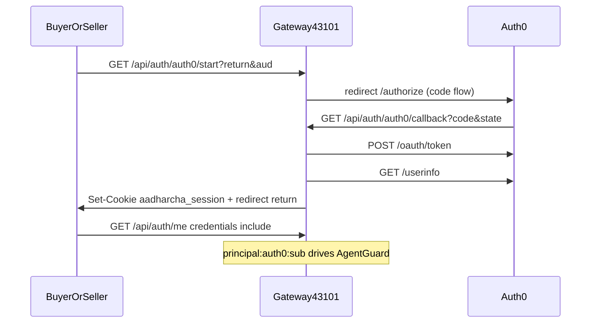

# Authentication (AgentGuard host identity)

> **Self-validate after edits.** Run `./scripts/validate.sh` from this skill directory.

**Product rule:** AgentGuard authorizes by **server session principal**, not wallet.  
Auth0 is the **PreProd/prod IdP**. Local `AUTH_DEMO_CONTINUE` is Hermes automation-only.  
Wallet/burner SSO is hangar — not AG acceptance.

**Standing rule:** append durable auth findings to this skill (+ evidence under `references/evidence/`); **no secrets** in markdown. Deploy/CI → [`portfolio-deploy`](../portfolio-deploy/SKILL.md).

**Docs:** [Auth0 Authorization Code Flow](https://auth0.com/docs/get-started/authentication-and-authorization-flow/authorization-code-flow) · repo [`AGENTS.md`](../../AGENTS.md) Host identity · [`PRODUCTION-READINESS.md`](../../PRODUCTION-READINESS.md) A8b.

## Owner map (do not invent parallel auth)

| Concern | Owner |
| --- | --- |
| OAuth + session mint | [`aadharchain/gateway/app/social_auth_routes.py`](../../aadharchain/gateway/app/social_auth_routes.py) |
| Signed OAuth `state` | [`aadharchain/gateway/app/oauth_state.py`](../../aadharchain/gateway/app/oauth_state.py) |
| Session cookie JWT-like HMAC | [`aadharchain/gateway/app/session_auth.py`](../../aadharchain/gateway/app/session_auth.py) |
| Env | gateway `AUTH0_*`, `AUTH_DEMO_CONTINUE`, optional `GOOGLE_*` — [`.env.example`](../../aadharchain/gateway/.env.example) |
| Buyer/Seller UI | `useAuthProviders` + `loginAuth0` in `ondcbuyer` / `ondcseller` `AuthContext` + `App.tsx` |
| AG principal binding | cookie → AgentGuard routes; body wallet cannot override social/demo session |

## Current flow (implement / debug against this)



Principals:
- `principal:auth0:…` — production (Auth0 `sub`, `|` → `:`)
- `principal:google:…` — legacy direct Google (prefer Auth0 Google connection)
- `principal:demo:…` — local automation only; **forced off** when `AADHAAR_CHAIN_ENV=staging|production` unless `AUTH_DEMO_CONTINUE_FORCE=true`

### Local demo SSO proof

Use `python3 scripts/hermes_demo_sso.py buyer|seller` through the WIP bridge. The helper navigates to `/api/auth/me`, reads the rendered JSON, returns to the app, and requires both a visible **Sign out** control and `principal:demo:…`. Do not call `fetch`, set cookies, or mutate the page through `evaluate`.

## Known hosts (2026-07-12)

| Role | URL |
| --- | --- |
| Buyer SPA (Vercel) | `https://ondcbuyer.aadharcha.in` |
| Seller SPA (Vercel) | `https://ondcseller.aadharcha.in` |
| Gateway (Render custom) | `https://gateway.aadharcha.in` |
| Gateway (Render subdomain, keep) | `https://identity-aadhar-gateway-main.onrender.com` |
| Local gateway | `http://127.0.0.1:43101` |
| Local Buyer / Seller | `http://127.0.0.1:43102` / `:43103` |

Auth0 **callback** is always on the **gateway**, never on the Vite FQDN. Prefer `gateway.aadharcha.in` so session cookie can use `Domain=.aadharcha.in`.

## Auth0 dashboard checklist (ops) — exact URLs

Application type: **Regular Web Application** (confidential; client secret on gateway only).

### Allowed Callback URLs

```
http://127.0.0.1:43101/api/auth/auth0/callback,
https://identity-aadhar-gateway-main.onrender.com/api/auth/auth0/callback,
https://gateway.aadharcha.in/api/auth/auth0/callback
```

`PUBLIC_GATEWAY_URL` on Render must be `https://gateway.aadharcha.in` (cookie Domain + Auth0 `redirect_uri`).

### Allowed Logout URLs

```
http://127.0.0.1:43102,
http://127.0.0.1:43103,
http://localhost:43102,
http://localhost:43103,
https://ondcbuyer.aadharcha.in,
https://ondcseller.aadharcha.in
```

### Allowed Web Origins

```
http://127.0.0.1:43102,
http://127.0.0.1:43103,
http://localhost:43102,
http://localhost:43103,
https://ondcbuyer.aadharcha.in,
https://ondcseller.aadharcha.in
```

### Connections

Enable **Google** (and others) **in Auth0** — do not add new raw Google OAuth unless hangar.

## Gateway env (never commit, never Vite)

```bash
AUTH0_DOMAIN=your-tenant.auth0.com   # operator pastes from Auth0
AUTH0_CLIENT_ID=                     # operator pastes
AUTH0_CLIENT_SECRET=                 # operator pastes
AUTH0_AUDIENCE=                      # optional API audience
AUTH0_REDIRECT_URI=                  # empty → {PUBLIC_GATEWAY_URL}/api/auth/auth0/callback
PUBLIC_GATEWAY_URL=http://127.0.0.1:43101
# Deployed Render:
# PUBLIC_GATEWAY_URL=https://identity-aadhar-gateway-main.onrender.com
AUTH_DEMO_CONTINUE=true              # local Hermes / sso demo only
AUTH_DEMO_CONTINUE_FORCE=            # only if staging/prod must keep demo-continue
AADHAAR_CHAIN_ENV=demo               # staging|production force-off demo-continue
CORS_ORIGINS=http://127.0.0.1:43100,http://127.0.0.1:43102,http://127.0.0.1:43103,http://127.0.0.1:43105,http://localhost:43100,http://localhost:43102,http://localhost:43103,http://localhost:43105,https://aadharcha.in,https://www.aadharcha.in,https://ondcbuyer.aadharcha.in,https://ondcseller.aadharcha.in,https://flatwatch.aadharcha.in
```

Verify local: `curl -s http://127.0.0.1:43101/api/auth/providers` → `"auth0": true` (after creds) and `"demo_continue": true` in demo mode.

## Vite (Buyer/Seller) — public only

| Var | Where | Purpose |
| --- | --- | --- |
| `VITE_IDENTITY_AUTH_ENABLED=true` | Vercel + local `.env.local` | Show Auth0 Sign in / Sign out (tree-shaken if unset) |
| `VITE_IDENTITY_URL` | Vercel → `https://gateway.aadharcha.in`; local → `http://127.0.0.1:43101` | Gateway origin for `/api/auth/*` |

Render holds `AUTH0_*` + `PUBLIC_GATEWAY_URL=https://gateway.aadharcha.in` + `CORS_ORIGINS` — never put client secret in Vite. Auth0 dashboard must allowlist gateway callback + SPA logout/web origins (FQDN section above).

## Deploy checklist (Auth0 → gateway → Vercel)

Do in order; ONDC portal/whitelist is a **parallel** track (other agent) — not required for Auth0 smoke.

1. **Auth0 dashboard** — Regular Web App; paste Callback / Logout / Web Origins above; enable Google connection.
2. **Gateway `.env` (local)** — paste `AUTH0_DOMAIN`, `AUTH0_CLIENT_ID`, `AUTH0_CLIENT_SECRET`; `PUBLIC_GATEWAY_URL=http://127.0.0.1:43101`; restart gateway.
3. **Gateway (Render)** — same `AUTH0_*`; `PUBLIC_GATEWAY_URL=https://gateway.aadharcha.in`; custom domain `gateway.aadharcha.in` verified + TLS; `AADHAAR_CHAIN_ENV=staging` (or `production`); `CORS_ORIGINS` includes both SPA FQDNs; `AUTH_DEMO_CONTINUE` omitted/false; **`DATA_DIR=/tmp/aadharchain-data`** (Free cannot write `./data` — AgentGuard ensure/checkout fail with Errno 13 otherwise; no Disk).
4. **Vercel Buyer** — `VITE_IDENTITY_AUTH_ENABLED=true`; `VITE_IDENTITY_URL=https://gateway.aadharcha.in`; redeploy (Hobby non-git bake if HUF git-author blocks).
5. **Vercel Seller** — same identity vars as Buyer.
6. **Cookie note** — with gateway under `*.aadharcha.in`, code sets `Domain=.aadharcha.in` (`SameSite=None; Secure` in staging/prod). SPA `credentials: 'include'` to `gateway.aadharcha.in` sees the session.
7. **Smoke** — providers `auth0:true`; Sign in on Buyer FQDN → return with **Sign out** + `/api/auth/me` authenticated.

## Session cookie rules (code)

| Mode | Secure | SameSite | Domain |
| --- | --- | --- | --- |
| Local demo (`http://127.0.0.1:43101`) | false | `lax` | host-only |
| Staging/prod or HTTPS `PUBLIC_GATEWAY_URL` | true | `none` | host-only unless gateway host is `*.aadharcha.in` → `.aadharcha.in` |

**Local host trap:** open Buyer/Seller as `http://127.0.0.1:4310x`, not `http://localhost:4310x`. Gateway cookie is host-only on `127.0.0.1`; `localhost` ≠ `127.0.0.1` for SameSite, so Accept succeeds but SPA still looks signed-out. SPAs redirect `localhost` → `127.0.0.1` in DEV (`ensureCanonicalLoopbackHost`). Do **not** fetch `/api/auth/me` via Vite same-origin proxy — cookie never lands on `:43102`/`:43103`.

## Auth0 features — fit to this ecosystem

Use Auth0 for **identity**; keep **AgentGuard** as the only money/mandate authority. Do not put AG limits in Auth0 Actions.

| Feature | Fit | Guidance |
| --- | --- | --- |
| **Universal Login + social connections** | **Use now** | Primary UX; Google/Apple via Auth0 connections |
| **Authorization Code Flow (RWA)** | **Use now** | Already implemented on gateway |
| **Organizations** | **Adopt when B2B sellers need tenants** | Map `org_id` → custom claim; store on session later; Buyer/Seller NP orgs |
| **Actions (Post-Login)** | **Adopt for claims only** | Add `email_verified`, `org_id`, `aud` hints as ID token claims — gateway may copy into `aadharcha_session`. Never enforce INR limits in Actions |
| **MFA / Adaptive MFA** | **Adopt for Seller elevated + prod** | Require MFA for seller refund/catalog publish principals before AG elevated writes (product decision) |
| **Attack Protection** (bot, brute-force, breached password) | **Enable in tenant** | No app code |
| **Refresh tokens** | **Defer** | App uses gateway cookie TTL today; add only if mobile/native or long API access without cookie |
| **RBAC / API permissions** | **Defer / light use** | Coarse roles (`buyer`, `seller`) OK; fine-grained commerce stays AgentGuard |
| **Passwordless / passkeys** | **Optional later** | Via Universal Login; no parallel login UI |
| **SAML/enterprise IdP** | **When enterprise sellers ask** | Auth0 connection; still emit `principal:auth0:…` |
| **Direct Google OAuth in gateway** | **Legacy only** | Prefer Auth0 Google connection; do not expand |

Detail: [`references/auth0-feature-fit.md`](references/auth0-feature-fit.md).

## Agent rules when editing auth

1. **Read this skill first** before changing login/session/OAuth.
2. Prefer extending Auth0 + gateway session — **no new IdP stacks** (Clerk, Cognito, custom JWT) without explicit product decision.
3. Frontends must use `/api/auth/providers` to show Sign in / demo-continue / Google — never hardcode demo CTAs in PreProd/prod paths.
4. Return URLs must pass `is_allowed_return_url` (CORS / portfolio origins).
5. OAuth `state` must stay **HMAC-signed** (`oauth_state.py`) — no in-memory-only state for multi-instance.
6. Secrets stay on gateway; Vite only gets `VITE_IDENTITY_AUTH_ENABLED` + API base URLs.
7. After auth changes: `PYTHONPATH=. .venv/bin/pytest -q tests/test_oauth_state.py tests/test_session_cookie_flags.py tests/test_social_auth.py`; smoke `GET /api/auth/providers`; for UI use **ondc-testing** / portfolio-browser (Auth0 on FQDN; `sso demo` local only).
8. Logout: clear `aadharcha_session`; optional Auth0 `/v2/logout` with `returnTo` allowlisted — add when shipping prod logout polish.

## Local smoke (after operator pastes Auth0 creds)

**Standing rule:** keep local gateway **`:43101` up for the entire Universal Login** (Auth0 redirect → callback → return). Do not run `start-dev.sh` / preflight / kill `:43101` while the Auth0 tab is open.

```bash
curl -s http://127.0.0.1:43101/api/auth/providers
# expect auth0:true, demo_continue:true (demo mode)

cd aadharchain/gateway && PYTHONPATH=. .venv/bin/pytest -q tests/test_oauth_state.py tests/test_session_cookie_flags.py tests/test_social_auth.py

# UI (Auth0): open Buyer :43102 → Sign in → Universal Login → return → /api/auth/me
# UI (local without Auth0): python3 scripts/portfolio_browser.py sso demo buyer
```

**HARD STOP without Auth0 dashboard values:** code + allowlists can be ready; `"auth0": false` until `AUTH0_DOMAIN` / `AUTH0_CLIENT_ID` / `AUTH0_CLIENT_SECRET` are set on the gateway. Do not invent secrets.

### Local Auth0 smoke — last run

| Field | Value |
| --- | --- |
| Date | 2026-07-12 |
| Result | **PASS** — after gateway-down callback failure recovered (see failure mode below) |
| App name | `aadharchain-gateway-local` (Regular Web Application) |
| Creds | `AUTH0_*` set in gateway `.env` only (never Vite; never commit) |
| Tenant domain | `dev-ejqlkc0qt84udk7i.us.auth0.com` (domain pattern only; no secrets) |
| `PUBLIC_GATEWAY_URL` | `http://127.0.0.1:43101` |
| providers | `auth0: true` |
| Allowlists | Callback `http://127.0.0.1:43101/api/auth/auth0/callback`; logout/web origins local `:43102`/`:43103` + localhost + buyer/seller FQDNs |
| UI | Buyer Sign out; banner “Signed in — elevated checkout…” |
| `/api/auth/me` | `principal:auth0:google-oauth2:…` (`identity_provider: auth0`) |
| Evidence | `references/evidence/auth0-buyer-signedin-20260712.json` + `.jpeg`; Universal Login `buyer-auth0-universal-20260712-140136.jpeg`; dashboard URL saves `auth0-urls-saved-20260712-135246.jpeg` |

## Failure mode: “refused to connect” after Universal Login

**Symptom:** After Auth0 login, browser shows connection refused (Chrome `ERR_CONNECTION_REFUSED`) instead of Buyer/Seller signed-in.

**Exact URL pattern (callback on gateway, not Vite):**

```
http://127.0.0.1:43101/api/auth/auth0/callback?code=…&state=…
```

`state` HMAC payload includes `return_url` (e.g. `http://127.0.0.1:43102/search`) and `aud`.

**Root cause (2026-07-12 local smoke):** local gateway `:43101` was **down** when Auth0 redirected back. Not an Auth0 dashboard mismatch in that run (`redirect_uri` was already `http://127.0.0.1:43101/api/auth/auth0/callback`).

**Diagnose:**

```bash
curl -sI http://127.0.0.1:43101/api/auth/providers   # connection refused ⇒ this failure mode
curl -s http://127.0.0.1:43101/api/auth/providers    # expect auth0:true
# AppleScript / Hermes: read tab URL — look for :43101/.../auth0/callback
```

**Fix:**

```bash
./scripts/start-dev.sh
# confirm: curl -s http://127.0.0.1:43101/api/auth/providers → auth0:true
```

If the refused tab still has the callback URL and `state.exp` is not past, **reload that exact tab** (Auth0 `code` is one-time + short-lived). Else start Sign in again from Buyer.

**Do not confuse with:** wrong Auth0 Allowed Callback URL (Auth0 error page on Auth0 host), `is_allowed_return_url` block (redirect to non-portfolio host), or WIP Hermes `SOCKET_DOWN` (automation only — not the refused-to-connect page).

**Race:** `start-dev.sh` / preflight **kills and restarts** `:43101`. Do not restart the stack while Universal Login is in flight — same as standing rule above.

## Web Auth0 smoke — last run (FQDN)

| Field | Value |
| --- | --- |
| Date | 2026-07-12 17:22 IST |
| Result | **PASS** — SPA session via `Domain=.aadharcha.in` |
| Buyer / Seller | `https://ondcbuyer.aadharcha.in` · `https://ondcseller.aadharcha.in` |
| Gateway | `https://gateway.aadharcha.in` (custom; onrender subdomain kept) |
| DNS | GoDaddy CNAME `gateway` → `identity-aadhar-gateway-main.onrender.com` |
| TLS | Render Free managed cert **Verified** / live HTTPS 200 |
| `PUBLIC_GATEWAY_URL` | `https://gateway.aadharcha.in` |
| providers | `auth0:true`, `demo_continue:false`, `runtime_mode:staging` |
| Auth0 callback | includes `https://gateway.aadharcha.in/api/auth/auth0/callback` |
| SPA `/api/auth/me` (credentials) | **Authenticated** `principal:auth0:…` |
| UI | Buyer **Sign out**; banner “Signed in — elevated checkout…” |
| Evidence | `references/evidence/spa-session-probe-20260712-172223.json` + `spa-buyer-after-signin-20260712-172223.jpeg` |

**Prior gap (same day):** host-only cookie on `*.onrender.com` left SPA Unsigned — fixed by custom domain cutover above (no same-origin proxy needed).

**Vercel Hobby deploy note:** git author `gupta.huf…` → `TEAM_ACCESS_REQUIRED` / BLOCKED. Workaround: non-git staging + skip remote build + `vercel alias` to `*.aadharcha.in`. No paid upgrade.

**Realtime false negative (2026-07-12 17:48):** Both gateway hosts returned `configured:true` while orb could still show “Realtime not configured” if mount-time `/api/realtime/status` raced or Free cold-start fetch failed. Fix: Buyer/Seller `SamanthaOrb` re-probes status on open (retries). SPA must use `VITE_IDENTITY_URL=https://gateway.aadharcha.in`. Evidence: `../ondc-testing/references/evidence/W-B-VOICE-RT-FIXED-20260712-174850-0.jpeg`.


## Cookie Domain (Render)

When `PUBLIC_GATEWAY_URL` host is under `*.aadharcha.in`, session cookie sets `Domain=.aadharcha.in` (`SameSite=None; Secure` in staging/prod). Keep onrender subdomain enabled as backup; do **not** emit `Domain=.aadharcha.in` from a response whose only public URL is `*.onrender.com`.

Ops: Free custom domains OK (Hobby workspace includes 2). Abort if UI charges for an extra domain beyond included quota — then same-origin Vercel `/api/auth/*` rewrite fallback.

## Do not

- Put signing keys, Auth0 secret, or session secret in Buyer/Seller Vite env.
- Use Auth0 to approve checkouts/refunds (that is AgentGuard).
- Reintroduce wallet as primary AG principal.
- Claim live ONDC identity / DigiLocker as required for login (Setu/MeitY optional KYC rails).
- Remove local `AUTH_DEMO_CONTINUE` for hermes/ondc-testing loopback automation.
- Flip `VITE_COMMERCE_DEMO_MODE` as part of auth work.

## Related skills

| Skill | When |
| --- | --- |
| [`portfolio-deploy`](../portfolio-deploy/SKILL.md) | FQDN deploy, `AUTH0_*` / `VITE_IDENTITY_*` on hosts, CI/CD, $0 Free/Hobby |
| [`ondc-testing`](../ondc-testing/SKILL.md) | Screenshot-proof Buyer/Seller journeys after login (web + local) |
| [`portfolio-browser`](../portfolio-browser/SKILL.md) | Hermes WIP, `sso demo`, preflight; cursor opacity / SW Inactive traps |
| [`apisetu-partner-onboarding`](../apisetu-partner-onboarding/SKILL.md) | ONDC portal / FQDNs / whitelist — **parallel** to Auth0; MeitY DigiLocker paused |
