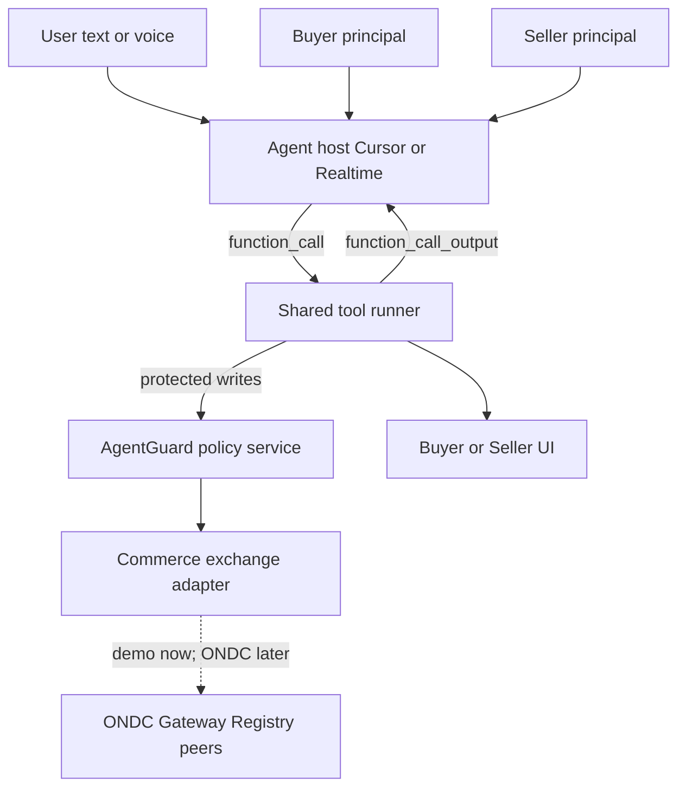
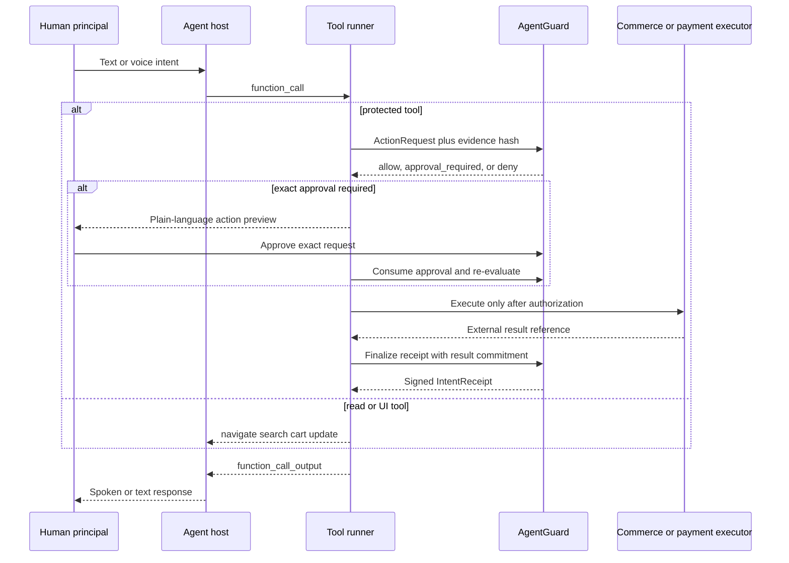

# AgentGuard Commerce Architecture

## Purpose and status

This document owns the technical architecture and protocol requirements for the
AgentGuard demonstration across ONDC Buyer and ONDC Seller. Build order lives in
`IMPLEMENTATIONPLAN.md`; verification in `TESTINGPLAN.md`; product scope in
`PRODUCTIDEA.md`.

The current deliverable is a local, ONDC-shaped two-sided commerce loop with
real server-side authorization, approval consumption, pause, and receipts.
Search, catalog exchange, orders, payment, logistics, and issue resolution are
simulated unless their implementation is explicitly verified. Live ONDC and
NPCI participation are target integrations, not current claims.

## Architectural principles

1. **AI proposes; deterministic code authorizes and executes.** A model may
   produce a typed action request but may not approve its own request.
2. **Protect consequences, not thought.** Reads, comparison, drafting, and
   recommendations remain frictionless. Money movement, commercial commitments,
   scarce inventory, order changes, and binding remedies cross AgentGuard.
3. **Least authority.** An agent receives named actions, resources, limits,
   counterparties, duration, and frequency—not a user's full session or admin
   credential.
4. **One contract, two roles.** Buyer and Seller share mandate, decision,
   approval, pause, and receipt semantics.
5. **Enforce at the mutation boundary.** UI state and model prompts are not
   security controls; the server holding the state or external credential must
   re-evaluate authority immediately before mutation.
6. **Private by construction.** Identity documents, addresses, conversations,
   carts, payment credentials, and order evidence remain in the owning app.
7. **Normal infrastructure first.** Durable state belongs in an ACID datastore;
   signatures make artifacts verifiable. No blockchain is required.

## System context



### Components

| Component | Responsibility | Current repository status |
| --- | --- | --- |
| AgentGuard policy service | Registration, mandates, evaluation, approval, pause, receipts | Hosted in `aadharchain/gateway`; identity-neutral principals in progress |
| Mandate editor | User edits allowed actions and auto-approve limits; compile + confirm | Seller Confirm/Pause only; editable limits required |
| Shared tool runner | Host-agnostic tools: navigate, search, cart, checkout, publish, refund | Missing; chat stages proposals without executing app tools |
| Agent host (text) | Cursor agent runtime for Buyer/Seller `/agent` | Wired via FlatWatch/gateway `CURSOR_API_KEY` |
| Agent host (voice) | OpenAI Realtime `gpt-realtime-2.1` WebRTC; same tools | Not started; ephemeral client secrets on gateway |
| Buyer application | Discovery, cart, guarded checkout, orders and issues | Demo commerce + AgentGuard checkout client |
| Seller application | Catalog, orders, fulfilment, guarded refunds | Demo + AgentGuard refund UI |
| Commerce exchange adapter | Catalog, search, orders between apps | Local `/api/demo-commerce` |
| ONDC protocol adapter | Registry, signed Beckn, callbacks | Scaffold; Milestone 9 |
| Payment adapter | Payment after Buyer authorization | Simulated |
| Durable state | Policy, nonce, approvals, commerce, receipts | File/local demo |
| Host identity adapter | Principal authentication | Google OAuth + demo-continue; wallet legacy only |

The historical `aadharchain` directory is an implementation source, not an
architectural trust substrate. AgentGuard interfaces must use neutral principal
identifiers and replaceable identity adapters.

### Tool runner contract

Tools are the only way a runtime agent mutates the app. Read tools may update
UI only. Protected tools must call `POST /api/agentguard/actions/execute` (or
evaluate + consume) before commerce mutation. Session tool lists are the
intersection of the host capability set and the confirmed mandate
`allowed_actions` (plus always-allowed reads: search, navigate, cart.prepare).

| Tool | Role | AgentGuard |
| --- | --- | --- |
| `search_catalog` | Buyer | No (read) |
| `navigate_to` | Buyer/Seller | No (UI) |
| `add_to_cart` | Buyer | No (preparation) |
| `checkout_commit` | Buyer | Yes → `buyer.checkout.commit` |
| `catalog_publish` | Seller | Yes → `seller.catalog.publish` |
| `refund_issue` | Seller | Yes → `seller.refund.issue` |
| `order_accept` / fulfilment / remedy | Seller | Yes → matching taxonomy |

The model never receives PIN, OTP, payment credentials, or raw identity
evidence. Prompt injection must not expand tools beyond the mandate.

Realtime voice sessions use the same runner: `session.update` tools filtered by
mandate; gateway mints ephemeral Realtime client secrets so browser clients
never hold long-lived OpenAI keys.

## Trust boundaries

- Model output, product descriptions, seller content, customer messages, tool
  results, and remote callbacks are untrusted input.
- Buyer and Seller backends own commerce state and external credentials.
- AgentGuard owns authorization state but does not own raw commerce evidence.
- Payment, logistics, identity, and ONDC participants are external systems whose
  responses require authentication, validation, idempotency, and audit.
- Browser clients may request actions but cannot assert authorization success.

Prompt injection in a listing or customer message must never expand an agent's
mandate, select an approval, reveal secrets, or bypass server enforcement.

## Shared control protocol

### Principal and agent

```text
PrincipalRef {
  principal_id, tenant_id, role: buyer | seller,
  identity_provider, assurance_level
}

AgentRef {
  agent_id, principal_id, role, status: active | paused | revoked,
  created_at, public_key_or_runtime_identity
}
```

`principal_id` is an opaque host-scoped identifier. Aadhaar number, payment
address, phone number, and identity documents are never identifiers in the
AgentGuard protocol.

### Mandate

```text
Mandate {
  mandate_id, version, principal_id, agent_id,
  purpose, allowed_actions[], denied_actions[],
  resource_scope, counterparty_scope, category_scope,
  per_action_limit, aggregate_limit, frequency_limit,
  valid_from, expires_at, approval_rules[], status,
  confirmed_at, confirmation_signature
}
```

Natural language is input to mandate compilation, not the enforcement format.
The principal confirms a canonical deterministic representation. Policy changes
create a new immutable version.

### Commerce action envelope

```text
ActionRequest {
  request_id, principal_id, agent_id, role, action,
  resource_type, resource_id, counterparty_id,
  amount, currency, quantity, purpose_code,
  transaction_id, evidence_hash, policy_version,
  nonce, requested_at, expires_at
}
```

Only fields needed for authorization enter AgentGuard. Full carts, addresses,
conversations, and payment credentials remain behind the host application's
boundary and are committed by hash where evidence binding is needed.

### Decision, approval, and receipt

```text
Decision {
  decision_id, request_id,
  outcome: allow | approval_required | deny,
  reason_codes[], policy_version, expires_at
}

Approval {
  approval_id, decision_id, request_hash,
  approved_by, approved_at, expires_at,
  nonce, status: available | consumed | expired | revoked,
  signature
}

IntentReceipt {
  receipt_id, request_hash, principal_id, agent_id,
  action, resource_commitment, amount, currency,
  mandate_id, policy_version, decision_id, approval_id?,
  execution_status, external_reference_hash?, executed_at,
  issuer_key_id, signature
}
```

Evaluation and approval consumption must occur in one transaction or equivalent
atomic operation. A receipt records the authorization and observed execution
result; it does not pretend a failed external payment succeeded.

## Action taxonomy

| Role | Action | Default treatment |
| --- | --- | --- |
| Buyer | search, compare, recommend, cart.prepare, issue.draft | Unprotected preparation |
| Buyer | checkout.commit | Protected by amount, merchant, category, cart hash and frequency |
| Buyer | order.cancel, return.submit, remedy.accept | Protected by order, timing and financial consequence |
| Seller | catalog.draft, support.draft, diagnose | Unprotected preparation |
| Seller | catalog.publish, price.change | Protected by item, magnitude and category |
| Seller | inventory.commit | Protected by item, quantity floor and velocity |
| Seller | order.accept, order.reject, fulfilment.commit | Protected by order and service constraints |
| Seller | remedy.promise, refund.issue | Protected by order, remedy type, amount and frequency |

The initial implementation may support fewer protected actions, but it must
deny unsupported actions rather than silently allow them. New actions require a
schema, policy rule, executor, receipt mapping, and negative tests.

## Two-sided commerce flow

### Local demonstration

1. Seller confirms an operations mandate.
2. Seller agent drafts a catalog item; protected publication is evaluated.
3. The local exchange stores a versioned product event visible to Buyer.
4. Buyer agent searches, compares, and prepares a cart.
5. Buyer `checkout.commit` is evaluated. If allowed or exactly approved, the
   payment adapter simulates payment and the exchange creates one order.
6. Seller receives the same `transaction_id`, evaluates protected order actions,
   and updates fulfilment.
7. Buyer raises an issue. Seller agent may draft a response; a binding remedy or
   refund is evaluated before execution.
8. Each protected mutation returns a receipt linked to the commerce transaction
   without exposing its private evidence.

The local exchange must exercise asynchronous request/callback behavior,
duplicate delivery, timeout, and idempotency so the demo does not encode a
synchronous marketplace architecture that cannot migrate to ONDC.

### AgentGuard decision sequence



## ONDC protocol requirements

ONDC uses a network extension over the Beckn protocol and asynchronous request
and callback APIs. A production adapter must meet the official version for its
enabled domain; examples below are architectural families, not a substitute for
the current domain specification.

### Participant onboarding and discovery

- Create the mandatory ONDC portal account and complete network participant
  onboarding for the intended roles and domains.
- Register each subscriber ID, role, domain, public callback URI, and signing and
  encryption public keys in staging/pre-production, then production.
- Meet production DNS ownership, key rotation, TLS, registry lookup, and gateway
  requirements.
- Treat Registry and Gateway endpoints as configuration, never browser secrets.

### Message security

- Digitally sign every Beckn request and callback using the prescribed HTTP
  authorization format; resolve the sender in Registry and verify before
  processing.
- Validate digest, signature, subscriber, key ID, timestamp, TTL, action, domain,
  and callback URI. Reject unknown, expired, malformed, or mismatched messages.
- Encrypt fields only where the active ONDC specification requires it and keep
  private keys in a managed key service, not application environment shipped to
  clients.
- Rotate keys without losing verification of historical receipts or in-flight
  transactions.

### Transaction lifecycle

Support the domain-required request/callback pairs, commonly including:

- `search` / `on_search` for discovery and catalog distribution;
- `select` / `on_select` for quote and fulfilment options;
- `init` / `on_init` for order initialization;
- `confirm` / `on_confirm` for order commitment;
- `status` / `on_status` and `track` / `on_track` for progress;
- `cancel` / `on_cancel` and `update` / `on_update` for changes; and
- the applicable issue and grievance APIs for complaints and resolution.

Preserve and validate ONDC context fields such as domain, action, version,
location, transaction ID, message ID, timestamp, TTL, BAP/BPP IDs, and callback
URIs. Map ONDC messages to internal commands and events; do not leak protocol
payloads directly into UI or AgentGuard policy.

### Reliability and conformance

- Deduplicate by subscriber, transaction ID, message ID, action, and payload
  commitment. A repeated callback must not repeat payment, inventory, refund, or
  receipt consumption.
- Persist inbound messages before acknowledgment and process through an outbox
  or equivalent reliable delivery pattern.
- Implement ACK/NACK, schema validation, correlation, retries with backoff,
  deadlines, late callback handling, compensation, and dead-letter review.
- Model commerce as a state machine; reject impossible or stale transitions.
- Version protocol mappers by ONDC domain release and test backward-compatible
  migrations where required.
- Pass official schema, log-validation, staging, pre-production, observability,
  and go-live requirements before claiming network participation.

### Payments, settlement, logistics, and issues

- Keep payment authorization separate from AgentGuard authorization: both must
  succeed, and neither substitutes for the other.
- Never expose a PIN, OTP, card secret, full token, or signing key to an AI
  model. Use a regulated provider's user-present flow or delegated interface.
- Reconcile authorization, payment, refund, settlement, and order state using
  immutable provider references and idempotency keys.
- Integrate fulfilment quotes, assignment, tracking, proof of delivery, returns,
  and serviceability through the applicable ONDC domain contracts.
- Maintain a timed issue/grievance state machine with ownership, evidence,
  escalation, resolution, and customer-visible status.

## Storage and integrity

Production needs a transactional database even though the product does not need
a blockchain. At minimum, persist:

- immutable mandate versions and confirmation records;
- current agent status and revocation epoch;
- action requests, decisions, one-time approvals, and nonce consumption;
- receipt bodies, signatures, issuer keys, and execution references;
- commerce transaction state, inbox/outbox records, deduplication keys, and
  callback attempts; and
- security audit events and administrator actions.

Encrypt sensitive application data at rest and in transit, segregate tenants,
apply retention limits, and redact logs. Hashes prove binding but do not make
guessable personal data anonymous; commitments must use canonicalization and
appropriate keyed hashing or salt.

## Security and safety requirements

- Strong authentication for principals; step-up for unusual or high-risk
  approvals.
- Explicit session, device, velocity, counterparty, amount, and category risk
  signals without silently changing the confirmed mandate.
- Constantly visible pause; revocation checked at execution time.
- Separation of policy administration, approval, execution, and audit duties.
- No long-lived broad commerce credentials in model context or browser storage.
- Tool allowlists, structured schemas, output validation, network egress limits,
  and injection-resistant separation of instructions from untrusted content.
- Rate limiting, abuse detection, tenant isolation, key rotation, backup,
  recovery, and incident response.
- Accessible plain-language previews that identify action, merchant/customer,
  amount, consequence, and reason for approval.

## Failure behavior

Fail closed for missing policy, stale versions, unavailable revocation state,
invalid signature, duplicate nonce, expired approval, unverifiable callback, or
ambiguous amount/resource. Do not fail closed for harmless drafting and search;
degrade those features without granting mutation authority.

External timeout produces an `unknown` execution state, not automatic retry of
a financial action. Reconcile using the same idempotency key before retrying or
compensating.

## Verification gates

### Demo-ready

- Contract tests prove both apps use the same schemas and reason codes.
- Unit/API tests cover allow, deny, approval, one-time consume, expiry, policy
  change, pause, revocation, and concurrent replay.
- A browser test completes seller publish → buyer checkout → seller order → issue
  or refund with stable transaction identity and no data repair.
- Adversarial tests cover malicious listing text, customer prompt injection,
  forged client decisions, cross-tenant access, callback replay, and payment
  timeout.
- UI and receipts clearly distinguish simulated commerce/payment from real
  authorization behavior.

### ONDC-ready

- Participant onboarding and keys are complete for the target environment.
- Official schemas and domain-version conformance tests pass.
- Signed request/callback verification, inbox/outbox delivery, duplicate and
  out-of-order handling, and observability are proven in staging/pre-production.
- Payment, settlement, logistics, grievance, privacy, and operational controls
  are independently reviewed.

No production or network-broadcast claim is permitted before the second gate.

## Delivery sequence

1. **Shared contract:** extract identity-neutral AgentGuard types, enforcement,
   and receipts from historical AadhaarChain naming.
2. **Local two-sided loop:** one Seller catalog event, Buyer discovery/checkout,
   shared order, Seller fulfilment, issue/refund, and browser proof.
3. **Coverage:** put every admitted protected action behind the same server-side
   evaluate/consume/finalize path; delete parallel trust gates.
4. **Mandate editor + tool runner:** user-editable limits; Cursor-hosted agents
   execute app tools under AgentGuard.
5. **Buyer Realtime voice:** `gpt-realtime-2.1` WebRTC on the same tool runner.
6. **Protocol-faithful adapter:** asynchronous signed-envelope abstractions,
   inbox/outbox, idempotency, state machines, and contract tests locally.
7. **External integration:** ONDC onboarding and pre-production, regulated
   payment handoff, logistics and grievance adapters, then conformance.

## Official references

- [ONDC official developer resources](https://github.com/ONDC-Official)
- [NPCI Token Nxt](https://www.npci.org.in/token-nxt)

The active ONDC domain specification and release notes take precedence over
examples in this document.
