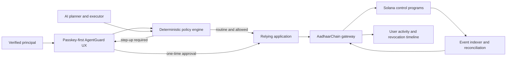

# AadhaarChain AgentGuard

## Product thesis

**AadhaarChain AgentGuard is a privacy-preserving authorization and
accountability network for AI agents acting on behalf of verified people and
organizations.**

It answers a question that identity systems, AI platforms, and blockchains do
not answer together:

> Did this verified principal authorize this exact AI agent to perform this
> exact action, on this resource, within these limits, at this time—and can
> every affected party verify, revoke, and audit that authority?

The product is not “Aadhaar on blockchain,” an identity token, a universal
reputation score, or an autonomous decision-maker. Aadhaar or another approved
identity source establishes who a consenting principal is. AgentGuard controls
what an AI agent may do after that identity event.

The initial product wedge is **verified AI-agent authorization for ONDC
sellers**. A later public-sector extension can secure AI-assisted
land-registration and mutation workflows without claiming that a blockchain
token creates legal title.

## Decision

This idea passes the product bar if it is built around four constraints:

1. **A valuable action, not identity alone:** protect financially, legally, or
   operationally consequential actions.
2. **Human authority remains primary:** AI may prepare, recommend, reconcile,
   and execute bounded actions; it does not acquire independent legal authority.
3. **Blockchain is the shared control plane:** use Solana only where parties
   need common, tamper-evident authorization, revocation, and receipts.
4. **The user never needs to understand blockchain:** passkey-first access,
   sponsored transactions, clear approvals, recovery, and one-tap revocation.

The concept should not proceed to production if external relying parties do not
value independently verifiable delegation more than conventional
application-local authorization.

## The customer problem

AI agents are moving from answering questions to performing actions: changing
prices, publishing catalogs, initiating refunds, preparing registrations,
reconciling payments, filing applications, and operating business workflows.

Existing controls are incomplete:

- Authentication proves who logged in, not what an AI agent was delegated to do.
- An API key often grants broad application access with weak human-readable
  limits.
- An application-local audit log cannot independently prove its history to
  another organization.
- Static KYC says that someone was verified, not that they approved a particular
  action.
- AI guardrails are normally controlled by the same operator whose behavior may
  later be disputed.
- Revoking a login or wallet does not necessarily revoke every agent, session,
  delegated key, or relying-party approval.

This produces six customer jobs:

1. **Establish the principal:** identify the person or authorized organization
   representative through a lawful assurance source.
2. **Delegate safely:** express exactly what an AI agent may and may not do.
3. **Approve precisely:** obtain fresh human approval when an action exceeds
   policy.
4. **Verify across organizations:** let another application validate authority
   without receiving identity evidence.
5. **Stop authority immediately:** suspend or revoke an agent across relying
   parties.
6. **Resolve disputes:** prove which policy, model/agent identity, approval, and
   action receipt applied at the time.

## Who pays and who benefits

| Actor                                 | Problem                                                                              | AgentGuard value                                                    |
| ------------------------------------- | ------------------------------------------------------------------------------------ | ------------------------------------------------------------------- |
| ONDC seller platform                  | AI and staff can make costly catalog, fulfillment, refund, and payout mistakes       | Bounded, revocable agent authority with step-up approval            |
| Seller or business owner              | Cannot supervise every routine action but remains accountable                        | Plain-language limits, alerts, receipts, pause, and recovery        |
| Buyer network participant             | Must know whether a seller-side agent was authorized                                 | Minimal, independently verifiable action proof                      |
| Housing society or FlatWatch operator | AI-assisted payment and evidence workflows are sensitive and disputable              | Dual control, purpose-bound authority, and audit receipts           |
| Government department or registrar    | AI can accelerate document workflows but must not silently change legal state        | Role-bound, multi-party approvals anchored to authoritative records |
| Bank or lender                        | Needs reliable evidence of who approved a mortgage or property-related workflow step | Cross-agency receipt verification without receiving Aadhaar data    |
| End user                              | Wants convenience without surrendering documents or uncontrolled authority           | Verify once, approve clearly, disclose minimally, revoke anytime    |

The initial economic buyer is an ONDC seller platform, marketplace, or
managed-commerce provider. The end user should not pay blockchain fees.

## Initial wedge: AgentGuard for ONDC sellers

### Use case

A verified seller gives an AI operations agent permission to:

- answer routine buyer questions;
- update inventory from approved data sources;
- adjust prices within a defined percentage;
- accept orders below a monetary threshold;
- prepare fulfillment and refund actions;
- request human approval for exceptions.

The seller can define a policy such as:

```text
Agent: Store Operations Assistant

May:
- update inventory from the connected ERP
- change price by at most 5%
- accept orders up to INR 25,000
- prepare refunds

Must ask me:
- refund above INR 5,000
- publish a new regulated product category
- change settlement or bank details
- add another administrator

Never:
- export identity documents
- reveal customer personal data outside the order purpose
- delegate authority to another agent

Expires: 30 days
```

The AI translates natural language into a deterministic policy. The user reviews
the generated rules, not an opaque summary. Enforcement uses the structured
policy; an LLM never decides whether its own action is authorized.

### Seller journey

1. The seller signs in with a passkey or an existing approved account.
2. The platform obtains a lawful identity/business assurance result.
3. AgentGuard creates an embedded cryptographic account; blockchain details
   remain hidden.
4. The seller selects a template or describes desired agent authority.
5. AI proposes structured permissions, exclusions, limits, expiry, and
   escalation rules.
6. The seller confirms the exact policy.
7. Routine actions execute only when deterministic enforcement permits them.
8. A sensitive action triggers a plain-language approval containing action,
   resource, counterparty, amount, data disclosed, and expiry.
9. The relying application verifies a one-time proof and current revocation
   state.
10. AgentGuard records a minimal receipt and shows the user an understandable
    activity timeline.
11. The seller can pause the agent, revoke a capability, rotate keys, or recover
    access.

### Approval example

> **Approve refund of INR 7,500?**
>
> Store Operations Assistant wants to refund Order 1284 to the original payment
> method. This exceeds your automatic refund limit of INR 5,000. ONDC Seller
> will learn only that the authorized seller approved this refund. Approval
> expires in five minutes.

Buttons: **Approve once**, **Reject**, **Pause agent**.

## Public-sector extension: land workflow AgentGuard

### What the evidence supports

Maharashtra already operates digital land-record services, including digitally
signed record extracts, mutation-related services, property cards, maps, and
document verification through Mahabhumi.[^mah-service]

Reporting from September 2022 described a Maharashtra blockchain pilot intended
to protect e-registration records from tampering and make original agreements
verifiable.[^mah-2022]

As of this research, the official National Blockchain Framework deployment list
names property-chain deployments in Jharkhand and Karnataka, not
Maharashtra.[^property-live]

Therefore this document does **not** claim that Maharashtra currently operates
tokenized or fractionally tradable land titles. Digitization, blockchain
document authenticity, sovereign title, and tradable asset tokenization are
different things.

### The genuine land use case

AgentGuard can protect the workflow around the sovereign land registry:

- a citizen authorizes an AI assistant to collect records and prepare an
  application;
- a broker receives limited access to specified parcels and documents;
- a surveyor signs a measurement or inspection step;
- a bank officer approves a mortgage-related workflow;
- a registrar or revenue officer performs the legally authoritative action;
- high-risk steps require dual or threshold approval;
- every party can verify authorization and workflow receipts;
- revocation or expiry stops future action immediately.

AI can:

- extract and reconcile legacy documents;
- detect inconsistent names, parcel identifiers, areas, or encumbrance
  references;
- identify missing documents and anomalous workflow changes;
- explain requirements in Marathi and other Indian languages;
- prepare applications and route them to the correct official;
- summarize risk for a human decision-maker.

AI must not:

- adjudicate ownership;
- decide a mutation or title transfer autonomously;
- infer legal capacity from Aadhaar authentication;
- override the authoritative land-record system;
- create a tradeable ownership token without an enabling legal framework;
- hide the evidence or policy behind an unexplained risk score.

The chain may prove who authorized or completed a workflow step. It does not
itself make the step legally valid. Legal validity continues to come from the
competent authority and authoritative registry.

### Land workflow example

1. The owner selects a parcel from the authoritative Mahabhumi record.
2. The owner authorizes a named AI assistant to retrieve specified records and
   prepare a mutation application for seven days.
3. The AI reconciles documents and flags discrepancies; it cannot submit if
   required evidence is missing.
4. The owner reviews the application in Marathi or English.
5. A passkey approval binds the owner, parcel, purpose, application digest, and
   expiry.
6. Required bank, surveyor, co-owner, or registrar approvals are collected
   according to the official workflow.
7. AgentGuard verifies roles and thresholds, while the government system
   performs the authoritative mutation.
8. A PII-free receipt commitment records the completed approval chain.
9. Banks or parties can verify the receipt against the government source without
   receiving Aadhaar documents.

## Fit with UIDAI's AI direction

### Confirmed direction

UIDAI's Aadhaar Vision 2032 review explicitly includes AI, blockchain, advanced
encryption, quantum computing, privacy, cybersecurity, and next-generation data
security.[^vision-2032]

UIDAI has already deployed or initiated capabilities that overlap with generic
“AI identity” ideas:

- consent-based 1:1 face authentication;[^face-auth]
- the SITAA innovation scheme, including passive face liveness,
  presentation-attack detection, and contactless fingerprint research;[^sitaa]
- AI-based biometric deduplication and document metadata verification under the
  announced “Invisible Shield”;[^shield]
- an Aadhaar app supporting proof of presence, biometric lock/unlock,
  authentication history, selective sharing, QR verification, and age-gating
  scenarios;[^aadhaar-app]
- a 2026 data-driven Aadhaar innovation hackathon using anonymized datasets for
  trends, anomalies, migration patterns, and service improvement.[^hackathon]

### Product-fit conclusion

AgentGuard complements these initiatives only if it stays downstream of UIDAI's
identity assurance:

```text
UIDAI or another approved issuer:
Is this consenting person present and valid at the required assurance level?

AgentGuard:
Did that principal authorize this AI agent to perform this exact action,
on this resource, within these limits, and is that authority still valid?
```

AgentGuard should not build biometric matching, liveness, deduplication, or
another general identity-sharing wallet. UIDAI is already advancing those
surfaces.

The gap not addressed by the cited initiatives is cross-application AI-agent
delegation, deterministic action constraints, one-time step-up approval,
revocation propagation, and independently verifiable action receipts. This is a
differentiated opportunity, not proof that no organization anywhere is pursuing
a similar product.

Any Aadhaar integration requires an applicable lawful route—for example an
approved authentication ecosystem role or compliant offline-verification flow.
The product must not imply UIDAI endorsement, retain unnecessary Aadhaar data,
or put Aadhaar numbers or deterministic Aadhaar-derived hashes on-chain.

## Fit with NPCI TokenNXT

### What TokenNXT is

NPCI's TokenNXT is a curated showcase inside the Bharat AI Zone at Global
Fintech Fest 2026, scheduled for 9–11 September 2026 in Mumbai. It is **not** an
NPCI tokenized-deposit, blockchain-settlement, or land-tokenization
platform.[^tokennxt]

The official page says NPCI will select at most 20 AI or deep-tech companies for
sponsored demonstration booths. Solutions must be functional and
live-demonstrable. Its published themes include:

- fraud, scams, deepfakes, and security;
- payments and transactions;
- credit and lending;
- compliance and regulation;
- banking operations;
- voice and Indian-language access;
- financial inclusion;
- robotics and process automation;
- wealth, investment, and quantum-related financial innovation.

The page lists applications opening on 20 June 2026, closing on **15 July
2026**, finalists announced on 20 August 2026, and the showcase on 9–11
September 2026. The current research date is 11 July 2026, so the published
submission window is still open but nearly closed.

### Does AgentGuard fit?

Yes—more directly than it fits a generic blockchain conference—but only as a
working AI safety and fintech-control product.

| TokenNXT criterion            | AgentGuard evidence needed                                                                                            |
| ----------------------------- | --------------------------------------------------------------------------------------------------------------------- |
| Innovation and credibility    | Verified-principal-to-AI-agent delegation, not another chatbot or fraud dashboard                                     |
| Live demonstrability          | Complete seller journey: policy creation, permitted action, blocked action, step-up approval, receipt, and revocation |
| Banking and fintech relevance | Refund, payout-change, settlement-detail, and agent-payment controls                                                  |
| Scalability and deployment    | Reusable relying-party SDK and deterministic policy service                                                           |
| Technology excellence         | Reliable policy compilation, action classification, replay protection, and measurable failure behavior                |
| Responsible AI                | Human control, minimal disclosure, explainability, bias testing, privacy, appeal, and fail-closed enforcement         |

AgentGuard spans several TokenNXT themes:

- **Fraud and security:** stops unauthorized or replayed AI-agent actions.
- **Payments and transactions:** applies limits and human approval to refunds,
  payouts, and settlement changes.
- **Compliance and regulation:** produces purpose-, policy-, and approval-bound
  evidence.
- **Banking operations:** safely delegates routine work while escalating
  material exceptions.
- **Voice and language:** lets Indian operators create and understand policies
  in their preferred language.
- **Financial inclusion:** hides wallet and blockchain complexity behind
  passkeys and sponsored transactions.

### What must not be claimed

- Selection would not mean NPCI certification, endorsement, partnership, or
  production approval.
- AgentGuard does not access NPCI payment rails merely by participating.
- TokenNXT does not validate the land-record use case.
- A concept document alone does not satisfy the published live-demonstrability
  requirement.

### Recommended TokenNXT demonstration

Build a five-minute, failure-visible ONDC seller scenario:

1. A verified seller creates a policy in English, Hindi, or Marathi: “My agent
   may refund up to INR 5,000.”
2. AI converts it into a structured policy and highlights the consequential
   limits.
3. A refund of INR 3,000 executes and produces a receipt.
4. A refund of INR 7,500 is blocked and requests seller approval.
5. The seller approves once with a passkey; the one-time proof is consumed.
6. A replay attempt visibly fails.
7. The seller pauses the agent; a subsequent routine action visibly fails.
8. A relying-party view independently verifies policy, approval, current status,
   and receipt without seeing Aadhaar data.

This demonstration proves AI utility, payment relevance, deterministic safety,
privacy, blockchain-backed shared evidence, and intuitive user control in one
coherent flow.

## Product boundary

### AI owns

- translating user intent into a proposed structured policy;
- explaining permissions and risks in the user's language;
- planning and executing actions permitted by deterministic controls;
- anomaly and fraud-risk detection;
- document reconciliation and missing-evidence detection;
- routing sensitive actions to appropriate humans;
- producing human-readable receipt summaries.

### Deterministic policy owns

- action allowlists and denylists;
- role, resource, amount, rate, time, geography, and counterparty limits;
- approval thresholds;
- data-disclosure scope;
- policy version and expiry;
- one-time nonce consumption;
- current suspension and revocation checks;
- fail-closed behavior.

### Solana owns

- trusted issuer and relying-party registries;
- AI-agent public identities and software/version commitments;
- delegation-policy commitments;
- minimal authority state and expiry;
- suspension and revocation state;
- approval and action-receipt commitments;
- threshold-governance and upgrade-authority evidence;
- settlement only where independent parties genuinely require it.

### Private systems own

- Aadhaar, PAN, biometrics, documents, OCR, and extracted PII;
- prompts, conversations, and private AI reasoning;
- detailed delegation policies and business data;
- ONDC carts, orders, catalogs, and customer data;
- FlatWatch receipts and resident data;
- land deeds, title documents, and authoritative registry records;
- detailed fraud features and investigation evidence.

## Technical architecture



### Core objects

#### Principal assurance

- opaque principal reference;
- audience-pairwise identifier;
- issuer and assurance level;
- allowed claims, issuance, expiry, suspension, and revocation;
- no raw identity evidence.

#### Agent identity

- agent public key;
- operator and principal references;
- software/model family and version commitment where available;
- execution environment attestation reference where available;
- status and key-rotation history.

#### Delegation policy

- principal, agent, relying party, purpose, and resource scope;
- allowed and prohibited actions;
- monetary, rate, time, counterparty, and data limits;
- escalation and threshold rules;
- validity interval, policy version, and revocation handle.

#### Action request

- unique request and nonce;
- exact action, resource, counterparty, amount, and payload digest;
- relying-party origin and audience;
- policy evaluation and required approvals;
- short expiry and domain separator.

#### Action receipt

- request, policy, agent, and approval references;
- outcome and timestamp;
- relying-party signature;
- private evidence location plus on-chain commitment;
- correction, dispute, and supersession references.

## Solana capabilities to use

### Sponsored transactions

AgentGuard or the relying enterprise pays fees for onboarding, delegation,
approval, rotation, and revocation. Users never need SOL. Sponsorship requires
simulation, quotas, purpose allowlists, rate limits, and isolated relayer
keys.[^solana-tx]

### Atomic authorization

Where the protected action also settles on Solana, policy validation, one-time
approval consumption, and execution should be one atomic transaction. Off-chain
actions use an equivalent server-side atomic consume-and-execute contract.

### Program-derived authority

Use PDAs for deterministic policy, agent, issuer, receipt, and revocation
accounts. Never derive identity commitments directly from low-entropy identity
numbers.

### Versioned PII-free events

Emit issuance, suspension, revocation, rotation, approval, and receipt events.
Use an idempotent indexer and reconciliation process. Anchor's `emit_cpi!`
should be considered when provider log truncation is unacceptable, with its
compute overhead measured.[^anchor-events]

### Verifiable deployments and governed upgrades

Publish program IDs, source commit, IDL, reproducible build digest,
deployed-bytecode verification, and upgrade-authority state. Production upgrades
require multisig, timelock, public change notice, and a narrowly scoped
emergency pause.[^anchor-build]

### Optional non-transferable credential

A Token-2022 non-transferable badge may improve interoperability for roles such
as “verified seller” or “registered verifier.” It is optional presentation—not
canonical identity—and still requires expiry, revocation, and controlled wallet
rotation.[^nontransferable]

### Defer until justified

- confidential transfers, except for a measured need such as private verifier
  compensation;
- durable nonces, except for offline institutional approvals;
- state compression, until real scale and storage cost justify indexer
  complexity;
- staking and tokens, until a real independent verifier market and slashing
  model exist.

## Security and safety invariants

1. Raw identity evidence and deterministic identity fingerprints never go
   on-chain.
2. A relying party receives only claims necessary for the current purpose.
3. Public identifiers are pairwise or otherwise resistant to cross-application
   correlation.
4. Every sensitive action is bound to agent, action, resource, counterparty,
   amount, audience, origin, policy version, nonce, and expiry.
5. Proofs are persisted and atomically consumed once.
6. Current suspension and revocation are re-read at execution time.
7. Operator identity comes from authenticated credentials, never caller-supplied
   reviewer fields.
8. AI proposes policies; deterministic code enforces them.
9. Unknown, stale, contradictory, or unavailable trust fails closed for
   consequential actions.
10. Key recovery uses threshold guardians, timelock, alerts, cancellation, and
    full credential re-binding.
11. Production authority uses hardware-backed keys, rotation, multisig,
    timelock, and monitored emergency procedures.
12. Every denial and escalation is explainable and appealable.
13. No universal reputation score controls access to essential services.
14. Demo fixtures, keys, and data cannot execute in a non-local environment.
15. The authoritative government or business system remains the source of legal
    and domain state.

## Current-workspace gaps to close

The current portfolio is a useful prototype but not this product yet:

- proof tokens need persistent atomic one-time consumption and fresh trust
  checks;
- sensitive evidence, review, and revocation APIs need authenticated operator
  authorization;
- public trust reads need data minimization and anti-correlation design;
- consent needs signed, versioned, purpose/field/retention/expiry receipts and a
  revoke dashboard;
- wallet recovery needs threshold control rather than a single recovery signer;
- oracle admission must cryptographically verify stake and operator eligibility;
- slashing must move real custody atomically with deactivation;
- the chain-to-gateway event, issuer, revocation, and trust-read bridge remains
  incomplete;
- upgrade authority needs governed control and verifiable builds;
- buyer, seller, and FlatWatch protected actions need server-side enforcement,
  not UI gating alone;
- managed databases, private object storage, key management, monitoring,
  retention, and incident response must replace demo infrastructure.

## Business model

### Initial model

- enterprise platform subscription;
- per active delegated agent;
- per high-assurance authorization or receipt bundle;
- premium compliance export, policy administration, and dispute tooling;
- no speculative consumer token.

### Why a customer pays

- fewer unauthorized AI actions;
- lower manual approval workload for routine operations;
- reduced identity-evidence custody;
- faster dispute resolution;
- common authorization across multiple relying organizations;
- demonstrable policy and audit controls for AI operations.

### Moat

The moat is not a chatbot or smart contract. It is:

- accepted issuer and relying-party integrations;
- a standard vocabulary for agent capabilities and action receipts;
- excellent delegation, approval, revocation, and recovery UX;
- cross-organization verification SDKs;
- policy templates proven in regulated and high-risk workflows;
- audit and dispute evidence recognized by counterparties;
- operational trust built through governance and incident handling.

## MVP

### Scope

Build one complete ONDC seller workflow:

1. Verify or fixture a seller through a clearly labeled assurance source.
2. Register one seller operations agent.
3. Create a deterministic delegation policy from a template or natural language.
4. Enforce catalog, pricing, refund, and payout-change permissions server-side.
5. Sponsor policy and revocation transactions.
6. Require one-time step-up approval for an over-limit refund.
7. Record and render a PII-free receipt timeline.
8. Pause and revoke the agent across the seller application.
9. Recover the principal account using a safe test recovery flow.
10. Demonstrate a dispute export containing policy, approval, action, and
    revocation evidence.

### Explicitly excluded

- mainnet land-title transfer;
- autonomous legal decisions;
- general consumer identity wallet;
- transferable credentials;
- token incentives;
- universal reputation;
- multiple biometric systems;
- full ONDC protocol production launch;
- unsupervised payout execution.

## Pilot and validation

Recruit three to five real seller or marketplace operators before expanding
scope.

### Product metrics

| Metric                                  | MVP target                                                                |
| --------------------------------------- | ------------------------------------------------------------------------- |
| Delegation-policy completion            | At least 80% without support                                              |
| Median policy creation time             | Under 5 minutes                                                           |
| Routine actions needing manual approval | Reduced without increasing unsafe execution                               |
| Sensitive action proof replay           | Zero successful replays                                                   |
| Cross-app revocation propagation        | Under 30 seconds in pilot                                                 |
| Recovery completion                     | At least 90% in controlled test                                           |
| User comprehension                      | At least 90% correctly identify action, limit, recipient, and consequence |
| False authorization                     | Zero in pilot                                                             |
| Audit receipt verification              | 100% independently reproducible                                           |

### Go/no-go tests

Proceed beyond the pilot only if:

- at least two organizationally independent relying parties want the same
  delegation proof;
- operators prefer bounded delegation over application-local API keys;
- passkey and sponsored-transaction UX does not materially reduce onboarding;
- revocation, recovery, and dispute flows work under adversarial testing;
- a legal/compliance review validates the proposed identity and domain
  integration path;
- the Solana layer creates verifiable multi-party value rather than duplicated
  database state.

Stop or reposition if customers primarily want simple application-local roles,
if no independent party verifies receipts, or if identity verification becomes
the product's main value.

## Roadmap

### Phase 0 — Trust repair

- close authentication, replay, privacy, consent, demo-isolation, oracle,
  recovery, and upgrade-authority gaps;
- define claim, delegation, action-request, receipt, revocation, and event
  schemas;
- document legal and source-of-truth boundaries.

### Phase 1 — ONDC seller MVP

- passkey-first embedded account;
- sponsored transactions;
- deterministic policy engine;
- catalog and refund controls;
- approval and receipt timeline;
- pause, revoke, and recovery.

For the TokenNXT submission window, reduce this to the smallest credible
vertical slice: one policy template, two refund amounts, one passkey approval,
one replay failure, one revocation failure, and one independently verifiable
receipt. Do not substitute mock UI success for server-side enforcement.

### Phase 2 — Independent pilot

- integrate a second relying organization;
- add event indexer reconciliation and dispute export;
- conduct security, privacy, recovery, and user-comprehension testing;
- measure business value.

### Phase 3 — FlatWatch

- bounded agent authority for receipt, challenge, and payment proposals;
- dual approval for sensitive society actions;
- private evidence with shared receipt commitments.

### Phase 4 — Land workflow sandbox

- integrate only with sandbox or officially permitted APIs;
- AI-assisted document reconciliation and multilingual explanation;
- parcel-, role-, purpose-, and time-bound delegation;
- threshold approval demonstration;
- no claim of legal mutation or tokenized title outside the authoritative
  system.

## Product promise

> **Verify once. Delegate safely. Approve precisely. Audit independently. Revoke
> anytime.**

That is the product. AI makes delegated work useful; Aadhaar or another approved
source establishes the principal; deterministic policy makes authority safe;
Solana makes shared authorization, revocation, and receipts independently
verifiable.

## Research sources and status

Research checked on 2026-07-11. Government roadmaps and pilots can change;
production integration requires renewed source and legal verification.

[^mah-service]:
    Maharashtra Bhumi Abhilekh, “Services,” current digital land-record
    services: <https://bhumiabhilekh.maharashtra.gov.in/Services>

[^mah-2022]:
    Moneycontrol, 6 September 2022, reported Maharashtra e-registration
    blockchain authenticity initiative:
    <https://www.moneycontrol.com/news/business/real-estate/maharashtra-authority-develops-blockchain-technology-to-store-property-buyers-e-registration-data-9140201.html>

[^property-live]:
    NIC/MeitY Centre of Excellence in Blockchain, live Property Chain
    deployments:
    <https://blockchain.gov.in/Home/LiveChain?LiveChain=PropertyChain>

[^vision-2032]:
    Press Information Bureau, 31 October 2025, “UIDAI initiates Technological
    and Strategic Review to shape the future of Digital ID”:
    <https://www.pib.gov.in/PressReleasePage.aspx?PRID=2184639>

[^face-auth]:
    UIDAI, authentication FAQ, consent-based 1:1 face authentication:
    <https://uidai.gov.in/en/contact-support/have-any-question/303-english-uk/faqs/authentication.html>

[^sitaa]:
    UIDAI/PIB, 16 October 2025, “UIDAI launches Scheme for Innovation and
    Technology Association with Aadhaar”:
    <https://www.uidai.gov.in/images/UIDAI_launches_Scheme_for_Innovation_and_Technology.pdf>

[^shield]:
    Press Information Bureau, 20 February 2026, UIDAI “Invisible Shield” AI
    deduplication and document-verification announcement:
    <https://www.pib.gov.in/PressReleasePage.aspx?PRID=2230654>

[^aadhaar-app]:
    Press Information Bureau, 6 May 2026, new Aadhaar App adoption and
    capabilities: <https://www.pib.gov.in/PressReleasePage.aspx?PRID=2258468>

[^hackathon]:
    UIDAI/NIC, Online Hackathon on Data-Driven Innovation on Aadhaar 2026:
    <https://event.data.gov.in/event/online-hackathon-on-data-driven-innovation-on-aadhaar-2026/>

[^tokennxt]:
    National Payments Corporation of India, “Token Nxt,” GFF 2026 Bharat AI Zone
    showcase, eligibility, evaluation criteria, and dates:
    <https://www.npci.org.in/token-nxt>

[^solana-tx]:
    Solana documentation, transaction structure and fee payer:
    <https://solana.com/docs/core/transactions/transaction-structure>

[^anchor-events]:
    Anchor documentation, events:
    <https://www.anchor-lang.com/docs/features/events>

[^anchor-build]:
    Anchor documentation, verifiable builds:
    <https://www.anchor-lang.com/docs/references/verifiable-builds>

[^nontransferable]:
    Solana documentation, Token-2022 non-transferable tokens:
    <https://solana.com/docs/tokens/extensions/non-transferrable-tokens>
